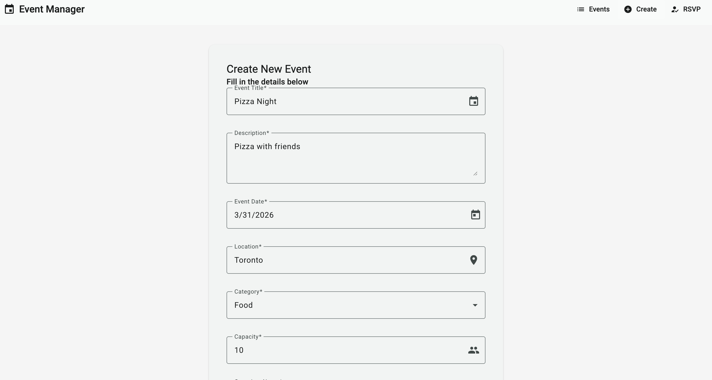
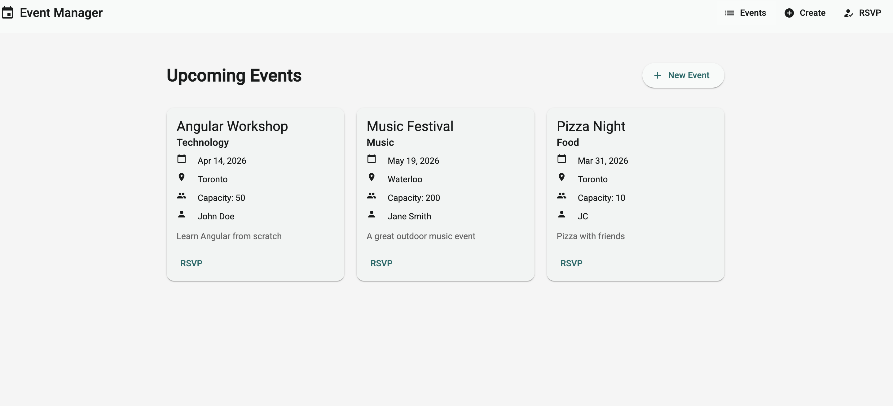
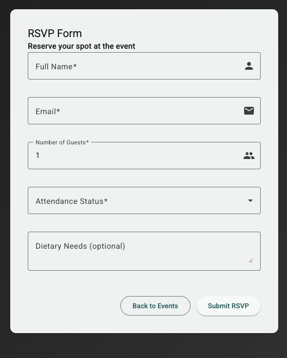

# EventsApp

Web application for managing events and RSVP confirmations, built with Angular and Angular Material.

## Technologies

- Angular 21
- Angular Material
- TypeScript
- RxJS

## Run Locally

1. Install dependencies:

```bash
npm install
```

2. Start the development server:

```bash
npm start
```

3. Open in your browser:

```text
http://localhost:4200
```

## Tests

```bash
npm test
```

## Screenshots

### Home screen



### Create event



### RSVP



## Main Structure

- `src/app/components/event-list`: event listing
- `src/app/components/create-event`: event creation form
- `src/app/components/rsvp-form`: RSVP confirmation form
- `src/app/services`: business logic and data layer
- `src/app/models`: TypeScript models
